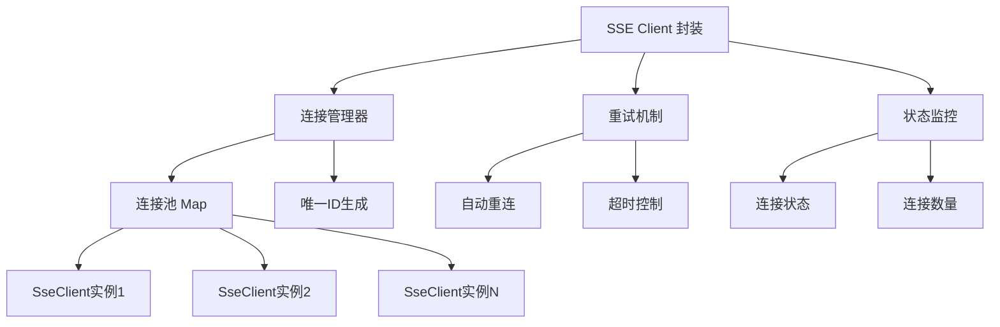

# SSE客户端封装：打造流畅的AI对话体验
[[toc]]

## 1. 功能背景

最近上线了AI对话功能，需要使用SSE来实现流式响应，所以需要一个SSE客户端封装组件。

**Server-Sent Events (SSE)** 作为HTML5标准的一部分，提供了一种简单、高效的服务器到客户端的单向实时数据推送解决方案。它具有以下优势：

- **轻量级**：基于HTTP协议，无需额外握手
- **自动重连**：浏览器原生支持断线重连
- **跨域支持**：支持CORS跨域请求
- **简单易用**：API简洁，学习成本低
- **服务器推送**：适配AI对话等流式数据场景

## 2. 功能介绍

模块主要提供以下核心功能：

### 2.1 核心特性

- ✅ **多实例管理**：支持同时创建多个SSE连接实例
- ✅ **自动重连机制**：网络异常时自动重试连接
- ✅ **连接池管理**：统一管理所有活跃连接
- ✅ **超时控制**：可配置连接超时时间
- ✅ **错误处理**：完善的错误捕获和处理机制
- ✅ **生命周期管理**：支持连接打开、消息接收、错误处理、连接关闭等完整生命周期
- ✅ **状态监控**：实时监控连接状态和数量

### 2.2 API接口

| 方法名 | 说明 | 参数 | 返回值 |
|--------|------|------|--------|
| `createSseConnection` | 创建新的SSE连接 | url, options | Promise\<SseClient\> |
| `closeSseConnection` | 关闭指定SSE连接 | client | void |
| `closeAllSseConnections` | 关闭所有SSE连接 | - | void |
| `isSseConnectionOpen` | 检查连接是否打开 | client | Boolean |
| `getAllSseConnections` | 获取所有活跃连接 | - | Array\<SseClient\> |
| `getSseConnectionCount` | 获取连接数量 | - | Number |

## 3. 设计思路

### 3.1 架构设计



### 3.2 设计思路

#### 3.2.1 多实例模式
- 每次调用 `createSseConnection` 都创建新的独立实例
- 使用Map结构管理所有连接实例
- 自动生成唯一ID标识每个连接

#### 3.2.2 错误恢复机制
- **分层错误处理**：连接层、解析层、业务层分级处理
- **智能重试**：可配置重试次数和间隔
- **超时保护**：防止连接长时间无响应

#### 3.2.3 生命周期管理
```javascript
创建连接 → 连接建立 → 消息接收 → 连接关闭
    ↓         ↓         ↓         ↓
  初始化   onOpen回调  onMessage  onComplete
    ↓         ↓         ↓         ↓
  设置超时   清除超时   数据处理   资源清理
```

#### 3.2.4 状态管理
- **连接状态**：isConnected标识连接状态
- **重试计数**：retryCount追踪重试次数
- **URL保存**：lastUrl用于重连时复用

### 3.3 关键要点

#### 3.3.1 EventSource封装
```javascript
this.eventSource = new EventSource(url);
this.eventSource.onopen = (event) => { /* 连接成功处理 */ };
this.eventSource.onmessage = (event) => { /* 消息处理 */ };
this.eventSource.onerror = (error) => { /* 错误处理 */ };
```

#### 3.3.2 消息解析机制
- JSON格式消息自动解析
- 状态码识别（默认88为完成状态）
- 错误消息容错处理

#### 3.3.3 连接池设计
- 使用Map存储所有连接：`connections = new Map()`
- 唯一ID策略：`时间戳 + 计数器`
- 自动清理：连接关闭时从连接池移除

## 4. 使用方法案例

### 4.1 基础使用

```javascript
import { createSseConnection } from '@/common/sseClient';

// 创建SSE连接
const sseConnection = await createSseConnection('/api/chat_stream', {
  onMessage: (data) => {
    console.log('收到消息:', data);
    // 处理流式数据
    if (data.data) {
      appendMessage(data.data);
    }
  },
  onOpen: (event) => {
    console.log('连接已建立');
  },
  onError: (error) => {
    console.error('连接错误:', error);
  },
  onComplete: () => {
    console.log('数据传输完成');
  }
});
```

### 4.2 AI对话流式响应（实际项目案例）

```javascript
// AI欢迎消息流式加载
activateWelcomeMsg() {
  const messageObj = {
    message: "",
    user_type: 2, // AI回复
    message_type: 1,
    create_time: new Date().toString(),
  };
  
  this.sendMessage(messageObj);
  const lastIndex = this.messages.length - 1;

  createSseConnection(`/ai_stream/qxz_welcome_msg?digest=${this.digest}`, {
    onMessage: (data) => {
      const { data: sseData } = data ?? {};
      if (sseData) {
        // 实时更新消息内容
        const updatedMessage = { ...this.messages[lastIndex] };
        updatedMessage.message += sseData;
        this.$set(this.messages, lastIndex, updatedMessage);
        
        // 自动滚动到底部
        this.$nextTick(() => {
          if (!this.userScrolled) {
            this.scrollToBottom();
          }
        });
      }
    },
    onError: (error) => {
      console.error("SSE连接错误:", error);
      this.readOnly = false;
    },
    onComplete: () => {
      console.log("SSE请求完成");
      this.readOnly = false;
    },
  });
}
```

### 4.3 高级配置使用

```javascript
// 自定义配置的SSE连接
const connection = await createSseConnection('/api/realtime-data', {
  // 消息处理
  onMessage: (data) => handleRealtimeData(data),
  
  // 连接配置
  timeout: 30000,        // 30秒超时
  maxRetry: 5,           // 最多重试5次
  statusCode: 200,       // 自定义完成状态码
  
  // 重试逻辑
  shouldRetry: (error) => {
    // 仅在网络错误时重试
    return error.type === 'error';
  },
  
  // 生命周期回调
  onOpen: () => console.log('实时数据连接已建立'),
  onError: (error) => logError('SSE Error', error),
  onComplete: () => cleanup()
});
```

### 4.4 连接管理

```javascript
import { 
  getAllSseConnections,
  getSseConnectionCount,
  closeAllSseConnections 
} from '@/common/sseClient';

// 监控连接状态
console.log('活跃连接数:', getSseConnectionCount());
console.log('所有连接:', getAllSseConnections());

// 页面卸载时清理所有连接
beforeDestroy() {
  closeAllSseConnections();
}
```

## 5. 完整代码

```javascript
/**
 * SSE客户端封装
 * 用于处理服务器发送事件(Server-Sent Events)的请求与响应
 * 默认使用多例模式，每次调用createSseConnection都会创建一个新的连接实例
 */

// 存储所有活跃的SSE连接实例
const connections = new Map();
// 用于生成唯一ID的计数器
let connectionCounter = 0;

class SseClient {
  constructor() {
    this.id = `sse_${Date.now()}_${connectionCounter++}`; // 自动生成唯一ID
    this.eventSource = null;
    this.retryCount = 0;
    this.maxRetry = 3;
    this.retryInterval = 2000; // 2秒重试间隔
    this.options = {};
    this.isConnected = false;
    this.connectionTimeout = null;
    this.lastUrl = ''; // 保存最后一次连接的URL
  }

  /**
   * 建立SSE连接
   * @param {String} url SSE请求地址
   * @param {Object} options 配置选项
   * @param {Function} options.onMessage 消息处理函数 (data) => {}
   * @param {Function} options.onOpen 连接成功回调 (event) => {}
   * @param {Function} options.onError 错误处理回调 (error) => {}
   * @param {Function} options.onComplete 完成回调函数 () => {}
   * @param {Number} options.timeout 连接超时时间(毫秒)，默认15000ms
   * @param {Number} options.maxRetry 最大重试次数，默认3次
   * @param {Function} options.shouldRetry 是否应该重试的函数 (error) => Boolean
   * @param {Number} options.statusCode 完成状态码，默认88
   * @returns {Promise} 返回Promise对象
   */
  connect(url, options = {}) {
    const baseUrl = process.env.VUE_APP_API;
    // 如果url开头四位是http，则不拼接baseUrl
    if (!url.startsWith('http')) {
      url = `${baseUrl}${url}`;
    }
    
    // 保存URL以便重试
    this.lastUrl = url;
    
    // 合并选项
    this.options = {
      onMessage: () => {},
      onOpen: () => {},
      onError: () => {},
      onComplete: () => {},
      timeout: 15000,
      maxRetry: this.maxRetry,
      shouldRetry: () => true,
      statusCode: 88,
      ...options
    };

    return new Promise((resolve, reject) => {
      // 关闭已有连接
      this.close();

      try {
        // 设置连接超时
        this.connectionTimeout = setTimeout(() => {
          if (!this.isConnected) {
            const error = new Error('SSE连接超时');
            this._handleError(error);
            reject(error);
          }
        }, this.options.timeout);

        // 创建EventSource对象
        this.eventSource = new EventSource(url);
        
        // 连接打开事件
        this.eventSource.onopen = (event) => {
          this.isConnected = true;
          clearTimeout(this.connectionTimeout);
          this.options.onOpen(event);
          resolve(this);
        };

        // 接收消息事件
        this.eventSource.onmessage = (event) => {
          try {
            const data = JSON.parse(event.data);
            
            // 检查是否是最终消息
            if (data.status === this.options.statusCode) {
              this.options.onComplete();
              this.close();
              return;
            }
            
            // 处理消息数据
            this.options.onMessage(data);
          } catch (error) {
            console.error('SSE消息解析错误:', error);
            this._handleError(error);
          }
        };

        // 错误处理事件
        this.eventSource.onerror = (error) => {
          this._handleError(error);
          if (this.retryCount >= this.maxRetry) {
            reject(error);
          }
        };

      } catch (error) {
        console.error('创建SSE连接失败:', error);
        this._handleError(error);
        reject(error);
      }
    });
  }

  /**
   * 处理错误
   * @private
   * @param {Error} error 错误对象
   */
  _handleError(error) {
    this.options.onError(error);
    
    // 清除超时计时器
    if (this.connectionTimeout) {
      clearTimeout(this.connectionTimeout);
      this.connectionTimeout = null;
    }

    // 检查是否应该重试
    if (this.retryCount < this.maxRetry && this.options.shouldRetry(error)) {
      this.retryCount++;
      console.log(`SSE连接失败，${this.retryInterval/1000}秒后进行第${this.retryCount}次重试`);
      
      // 关闭当前连接
      this.close();
      
      // 延迟重试
      setTimeout(() => {
        this.connect(this.lastUrl, this.options)
          .catch(err => console.error('SSE重试连接失败:', err));
      }, this.retryInterval);
    } else {
      this.close();
    }
  }

  /**
   * 关闭SSE连接
   */
  close() {
    if (this.eventSource) {
      this.eventSource.close();
      this.eventSource = null;
    }
    
    this.isConnected = false;
    
    if (this.connectionTimeout) {
      clearTimeout(this.connectionTimeout);
      this.connectionTimeout = null;
    }
    
    // 从连接池中移除
    connections.delete(this.id);
  }

  /**
   * 检查连接是否打开
   * @returns {Boolean} 连接状态
   */
  isOpen() {
    return this.isConnected && this.eventSource && this.eventSource.readyState === 1;
  }
}

/**
 * 创建新的SSE连接
 * @param {String} url SSE请求地址
 * @param {Object} options 配置选项
 * @returns {Promise<SseClient>} 返回Promise，解析为SSE客户端实例
 */
export const createSseConnection = (url, options = {}) => {
  const client = new SseClient();
  
  // 添加到连接池
  connections.set(client.id, client);
  
  return client.connect(url, options).then(() => client);
};

/**
 * 关闭指定的SSE连接
 * @param {SseClient} client SSE客户端实例
 */
export const closeSseConnection = (client) => {
  if (client && typeof client.close === 'function') {
    client.close();
  }
};

/**
 * 关闭所有SSE连接
 */
export const closeAllSseConnections = () => {
  connections.forEach(client => client.close());
  connections.clear();
};

/**
 * 检查指定的SSE连接是否打开
 * @param {SseClient} client SSE客户端实例
 * @returns {Boolean} 连接状态
 */
export const isSseConnectionOpen = (client) => {
  return client && typeof client.isOpen === 'function' && client.isOpen();
};

/**
 * 获取当前所有活跃的SSE连接
 * @returns {Array<SseClient>} 连接实例数组
 */
export const getAllSseConnections = () => {
  return Array.from(connections.values());
};

/**
 * 获取活跃连接数量
 * @returns {Number} 连接数量
 */
export const getSseConnectionCount = () => {
  return connections.size;
};

export default {
  createSseConnection,
  closeSseConnection,
  closeAllSseConnections,
  isSseConnectionOpen,
  getAllSseConnections,
  getSseConnectionCount
};
```

## 8. 注意事项

1. **浏览器兼容性**：IE不支持EventSource，需要polyfill
2. **连接数限制**：浏览器对同域SSE连接有数量限制（通常6个）
3. **内存泄漏**：组件销毁时务必调用 `closeAllSseConnections()`
4. **网络环境**：移动网络下注意连接稳定性
5. **服务端配置**：需要服务端正确设置CORS和SSE headers

