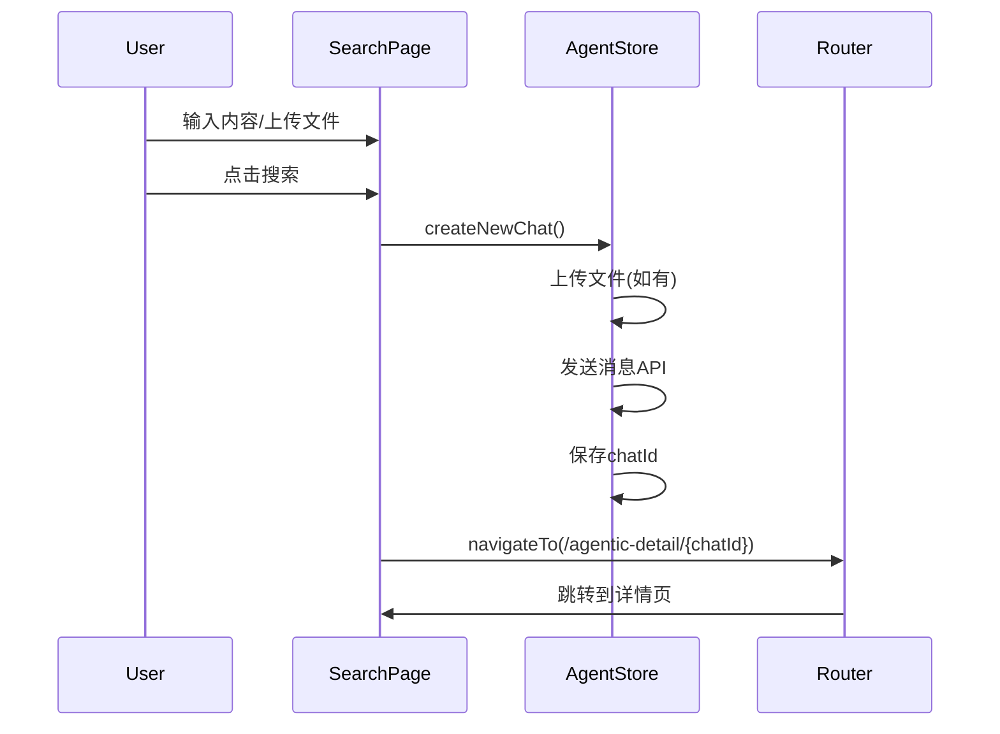
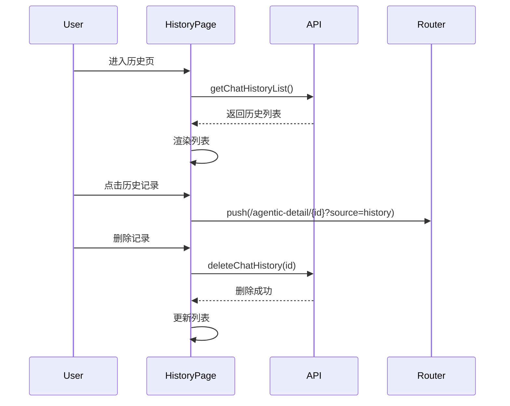
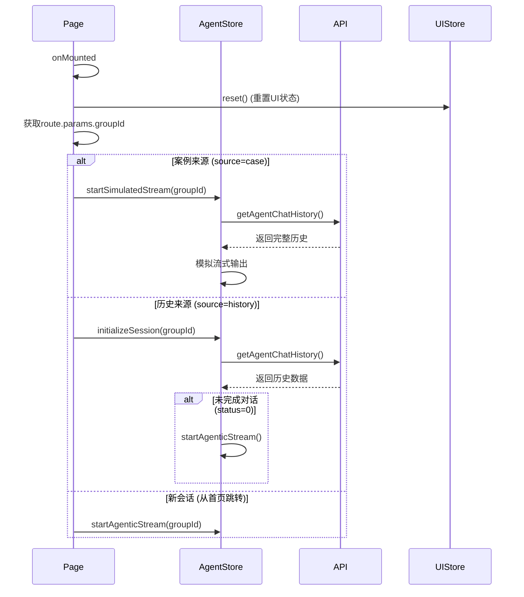
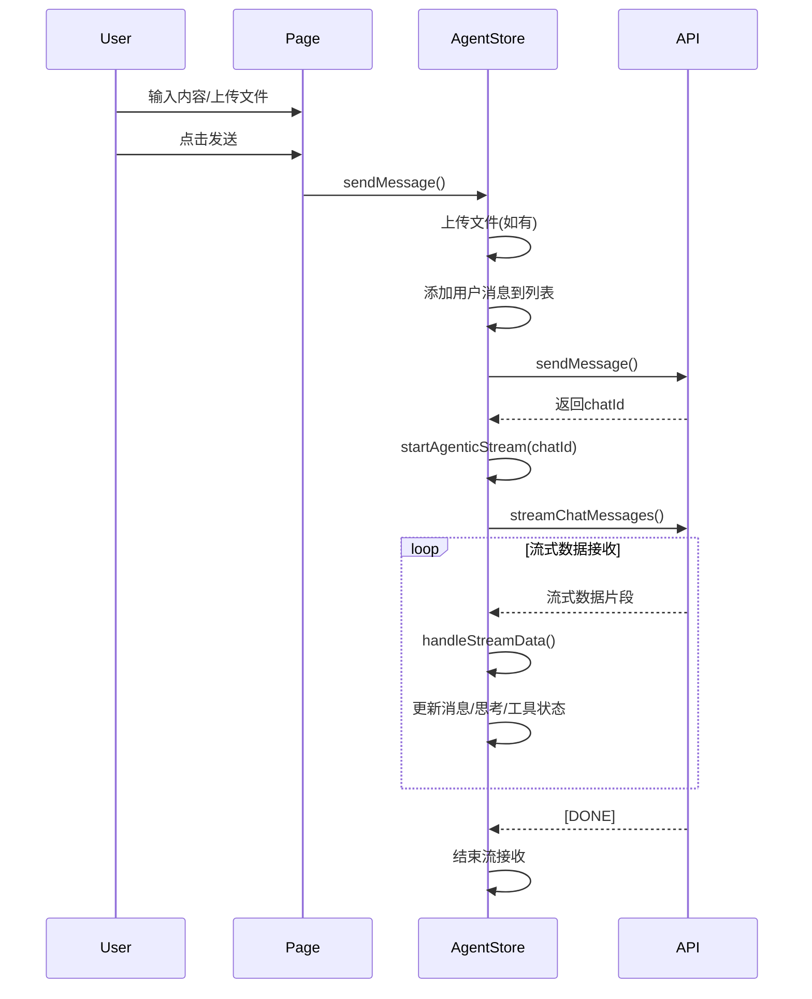
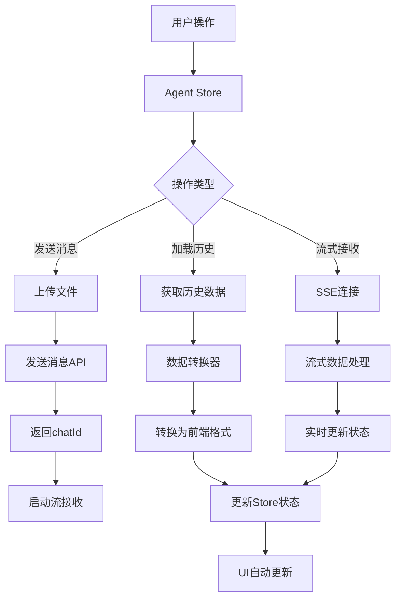
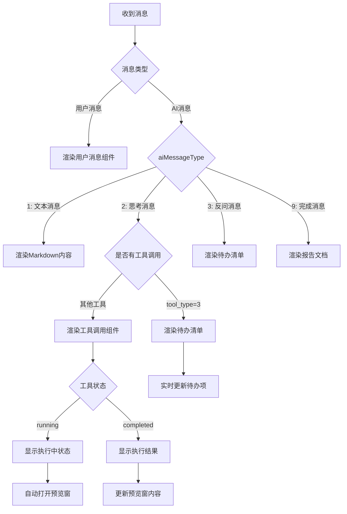
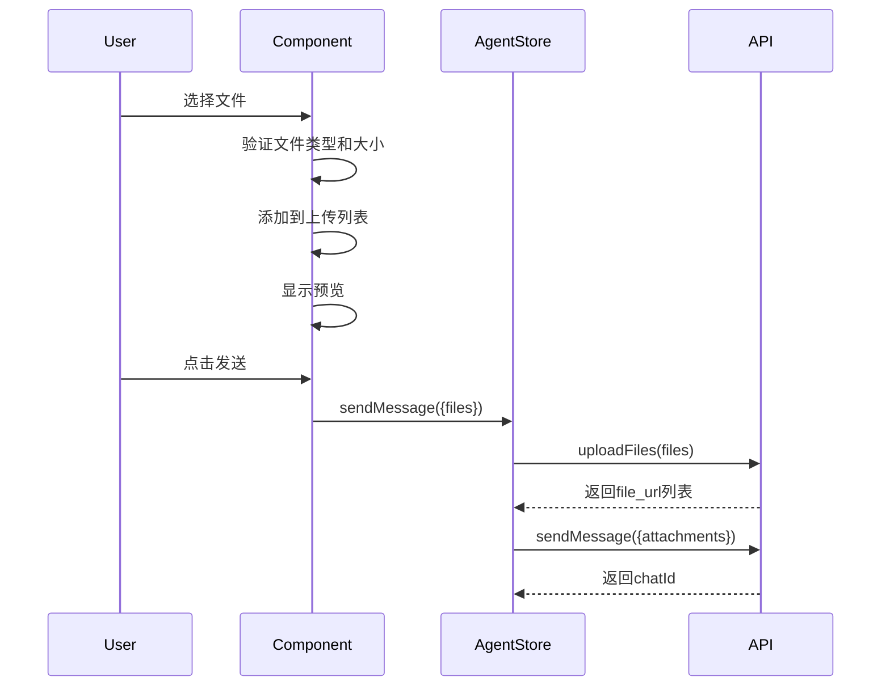
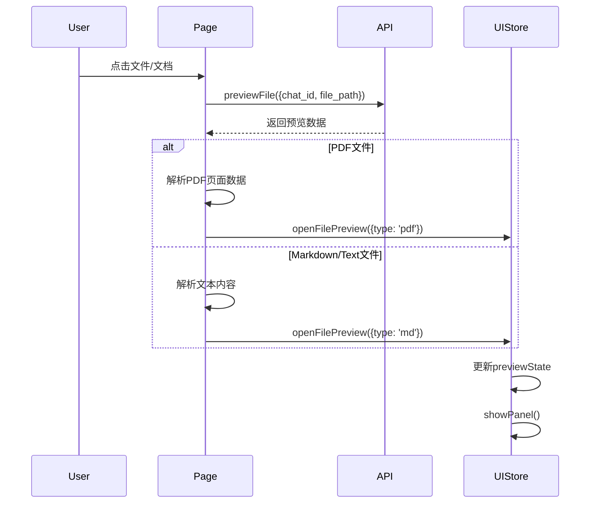

# Agentic AI 系统前端设计文档

[[toc]]

## 文档概述

本文档详细描述了 Agentic AI 助手系统的最终落地实现情况，包括系统架构、核心流程、状态管理、数据流转、UI交互等各个方面的设计细节。

**文档版本**: v1.0.0

---

## 系统概述

### 系统定位

Agentic 是一个智能 AI 助手系统，支持用户通过自然语言与 AI 进行对话，AI 能够执行复杂任务、调用工具、生成文档，并提供实时的思考过程和执行状态反馈。

### 核心能力

1. **智能对话**: 支持多轮对话，理解用户意图
2. **任务执行**: AI 能够生成待办清单并执行任务
3. **工具调用**: 支持文件编辑、代码生成等多种工具
4. **文件管理**: 支持文件上传、预览、下载
5. **实时反馈**: 流式输出思考过程和执行状态
6. **历史管理**: 保存对话历史，支持恢复和继续

---

## 系统架构

### 整体架构图

```md
┌─────────────────────────────────────────────────────────────┐
│                        用户界面层                              │
├─────────────────────────────────────────────────────────────┤
│  agentic-search/          agentic-detail/                    │
│  ├─ index.vue             ├─ [groupId].vue                  │
│  └─ history.vue           └─ (对话详情页)                     │
└─────────────────────────────────────────────────────────────┘
                            ↓
┌─────────────────────────────────────────────────────────────┐
│                      组件层 (Components)                       │
├─────────────────────────────────────────────────────────────┤
│  components/agentic/                                         │
│  ├─ SearchInputAgentic.vue        (搜索输入组件)             │
│  ├─ AgenticCaseComponent.vue      (案例展示组件)             │
│  │                                                           │
│  ├─ dialogue/                      (对话窗口)            │
│  │  ├─ DialogueWindow.vue          (对话窗口主组件)          │
│  │  ├─ EnhancedMessageRenderer.vue (消息渲染组件)            │
│  │  ├─ MessageReportDocument.vue   (报告文档组件)            │
│  │  ├─ MessageTodoList.vue         (待办清单组件)            │
│  │  ├─ MessageToolInvocation.vue   (工具调用组件)            │
│  │  ├─ UploadedFilesDisplay.vue    (上传文件展示)            │
│  │  ├─ ProgressBar.vue             (进度条组件)             │
│  │  ├─ SkipStreamButton.vue        (跳过流式按钮)            │
│  │  └─ DownloadFormatDialog.vue    (下载格式对话框)          │
│  │                                                           │
│  └─ agentic-panel/                 (Agentic视窗)         │
│     ├─ AgenticPanel.vue            (视窗主组件)              │
│     ├─ AgenticPanelHeader.vue      (视窗头部)               │
│     ├─ AgenticPanelLeft.vue        (左侧入口组件)            │
│     ├─ AgenticFileManager.vue      (文件管理器)              │
│     ├─ AgenticMdPreview.vue        (Markdown预览)            │
│     ├─ AgenticPdfPreview.vue       (PDF预览)                 │
│     └─ AgenticToolStatusBar.vue    (工具状态栏)              │
└─────────────────────────────────────────────────────────────┘
                            ↓
┌─────────────────────────────────────────────────────────────┐
│                     状态管理层 (Stores)                       │
├─────────────────────────────────────────────────────────────┤
│  agentic.ts (业务状态)          agentic-ui.ts (UI状态)       │
│  ├─ 会话管理                    ├─ 布局状态                  │
│  ├─ 处理状态                    ├─ Tab状态                    │
│  ├─ 消息历史                    ├─ 展开/折叠状态             │
│  ├─ 思考流                      ├─ 预览状态                  │
│  ├─ 待办任务                    ├─ 工具结果Tabs             │
│  ├─ 工具调用                    ├─ 文件管理器                │
│  ├─ 文件索引                    └─ 通知状态                  │
│  ├─ 引用信息                                                 │
│  ├─ 会话信息                                                 │
│  ├─ 反馈请求                                                │
│  ├─ 流式数据控制                                            │
│  └─ 模拟流式输出                                            │
└─────────────────────────────────────────────────────────────┘
                            ↓
┌─────────────────────────────────────────────────────────────┐
│                     服务层 (Services)                         │
├─────────────────────────────────────────────────────────────┤
│  agentApi.ts                dataTransformers.ts             │
│  ├─ API调用封装             ├─ 数据转换器                  │
│  ├─ 流式数据处理             ├─ 消息转换                    │
│  └─ 错误处理                └─ 类型转换                     
└─────────────────────────────────────────────────────────────┘
                            ↓
┌─────────────────────────────────────────────────────────────┐
│                     后端 API 层                               │
├─────────────────────────────────────────────────────────────┤
│  /agent/send_message        /agent/chat/{id}/stream          │
│  /agent/chat_history       /agent/preview_file             │
│  /upload                    /agent/list_files ...           │
└─────────────────────────────────────────────────────────────┘
```

### 技术栈

- **前端框架**: Vue 3 + Nuxt 3
- **状态管理**: Pinia
- **类型系统**: TypeScript
- **UI组件**: Element Plus
- **数据流**: Server-Sent Events (SSE)
- **构建工具**: Vite

---

## 页面结构

### 1. 搜索首页 (`/agentic-search`)

**文件路径**: `pages/agentic-search/index.vue`

#### 功能概述

用户进入系统的首页，提供搜索输入框和案例展示。

#### 核心功能

1. **搜索输入**
   - 支持文本输入
   - 支持文件上传（最多5个文件）
   - 支持提示词自动补全
   - 支持多种搜索模式（fast/accurate）

2. **案例展示**
   - 展示推荐案例、研究案例、PPT案例
   - 支持Tab切换
   - 点击案例跳转到详情页

#### 关键流程



#### 代码实现要点

```typescript
// 创建新会话（不启动流数据）
const chatId = await agentStore.createNewChat({
    content: params.text,
    files: params.files,
    mode: params.mode,
    domains: params.type
})

// 跳转到详情页
await navigateTo(`/agentic-detail/${chatId}`)
```

### 2. 历史记录页 (`/agentic-search/history`)

**文件路径**: `pages/agentic-search/history.vue`

#### 功能概述

展示用户的历史对话记录，支持查看、删除操作。

#### 核心功能

1. **历史列表**
   - 分页加载历史记录
   - 显示对话标题、更新时间
   - 支持滚动加载更多

2. **操作功能**
   - 点击记录跳转到详情页
   - 支持删除历史记录
   - 显示加载状态

#### 关键流程



### 3. 对话详情页 (`/agentic-detail/[groupId]`)

**文件路径**: `pages/agentic-detail/[groupId].vue`

#### 功能概述

核心对话页面，展示对话内容、AI思考过程、工具执行状态等。

#### 页面布局

```md
┌─────────────────────────────────────────────────────────┐
│  头部: 返回按钮 + 标题 + 文件管理器按钮                    │
├──────────────────────────┬──────────────────────────────┤
│                          │                              │
│   对话窗口 (左侧)         │   Agentic面板 (右侧)          │
│                          │                              │
│  - 消息列表              │  - Thinking Tab              │
│  - 输入框                │  - Todo Tab                  │
│  - 文件上传              │  - Tools Tab                 │
│                          │  - Files Tab                 │
│                          │                              │
│                          │  - 文件预览                  │
│                          │  - 工具结果预览               │
│                          │                              │
└──────────────────────────┴──────────────────────────────┘
```

#### 核心功能

1. **对话展示**
   - 用户消息和AI消息
   - 支持Markdown渲染
   - 支持文件预览
   - 支持工具调用展示

2. **流式数据接收**
   - 实时接收AI思考过程
   - 实时更新工具执行状态
   - 实时更新待办清单

3. **文件管理**
   - 文件上传
   - 文件预览（PDF/Markdown/Text）
   - 文件下载

4. **工具预览**
   - 自动打开工具执行预览
   - 显示工具执行状态
   - 显示工具执行结果

#### 关键流程

**页面初始化流程**:



**消息发送流程**:



---

## 状态管理设计

### Store 架构

系统采用双 Store 架构，将业务状态和UI状态完全分离：

```md
┌─────────────────────────────────────────────────────────┐
│                    Agent Store                           │
│                  (业务状态管理)                          │
├─────────────────────────────────────────────────────────┤
│  • 会话状态 (sessionId, threadGroupId)                   │
│  • 消息历史 (messages)                                  │
│  • 思考流 (thinkingStream)                              │
│  • 待办任务 (todoList)                                  │
│  • 工具调用 (toolCalls)                                 │
│  • 文件索引 (indexedFiles)                             │
│  • 流式数据处理                                          │
└─────────────────────────────────────────────────────────┘

┌─────────────────────────────────────────────────────────┐
│                  Agentic UI Store                        │
│                    (UI状态管理)                          │
├─────────────────────────────────────────────────────────┤
│  • 布局状态 (面板宽度、显示状态)                         │
│  • Tab状态 (activeTab, tabBadges)                       │
│  • 展开/折叠状态                                         │
│  • 预览状态 (文件预览、工具预览)                         │
│  • 通知状态                                              │
└─────────────────────────────────────────────────────────┘
```

### Agent Store 详细设计

**文件路径**: `stores/agentic.ts`

#### 核心状态

```typescript
// 会话状态
const sessionId = ref<string | null>(null)
const threadGroupId = ref<string | null>(null)
const threadId = ref<string | null>(null)

// 处理状态
const isProcessing = ref(false)
const isLoadingData = ref(false)

// 消息历史
const messages = ref<Message[]>([])

// 思考流
const thinkingStream = ref<Thought[]>([])

// 待办任务
const todoList = ref<TodoTask[]>([])

// 工具调用
const toolCalls = ref<ToolCall[]>([])

// 文件索引
const indexedFiles = ref<FileItem[]>([])

// 引用信息
const allCitations = ref<Citation[]>([])
```

#### 核心方法

1. **会话管理**
   - `initializeSession(groupId?)`: 初始化会话
   - `loadHistoryByGroupId(groupId)`: 加载历史记录
   - `loadAgentChatHistory(chatId, checkResume)`: 加载聊天历史

2. **消息发送**
   - `createNewChat(params)`: 创建新会话（首页使用）
   - `sendMessage(params)`: 发送消息并启动流接收

3. **流式数据处理**
   - `startAgenticStream(chatId, options)`: 开始接收流数据
   - `handleStreamData(data)`: 处理流式数据
   - `processMessageWithTransformer(data, chatId)`: 使用转换器处理消息

4. **模拟流式输出**
   - `startSimulatedStream(chatId)`: 启动模拟流（案例来源）
   - `playNextSimulatedMessage()`: 播放下一条消息
   - `skipSimulatedStream()`: 跳过模拟，直接渲染全部

5. **操作控制**
   - `abort()`: 中止当前操作
   - `reset()`: 重置所有状态

#### 数据流转



### Agentic UI Store 详细设计

**文件路径**: `stores/agentic-ui.ts`

#### 核心状态

```typescript
// 布局状态
const leftPanelWidth = ref(60)
const rightPanelWidth = ref(40)
const showAgenticPanel = ref(false)
const isFullscreen = ref(false)

// Tab状态
const activeAgenticTab = ref<AgenticTab>('thinking')
const tabBadges = ref<Record<AgenticTab, number>>({...})

// 展开/折叠状态
const isThinkingExpanded = ref(true)
const expandedTodoIds = ref<Set<string>>(new Set())
const expandedToolCallIds = ref<Set<string>>(new Set())

// 预览状态
const previewState = ref<PreviewState>({
    isPreviewMode: false,
    currentFile: null,
    previewType: 'none'
})

// 文件管理器
const showFileManager = ref(false)
const fileManagerChatId = ref<string | null>(null)
```

#### 核心方法

1. **布局控制**
   - `resizePanels(leftWidth)`: 调整面板宽度
   - `toggleAgenticPanel()`: 切换面板显示
   - `showPanel()` / `hidePanel()`: 显示/隐藏面板

2. **Tab管理**
   - `switchAgenticTab(tab)`: 切换Tab
   - `updateTabBadge(tab, count)`: 更新Tab角标
   - `incrementTabBadge(tab)`: 增加Tab角标

3. **预览管理**
   - `openFilePreview(file)`: 打开文件预览
   - `closeFilePreview()`: 关闭文件预览
   - `goBackPreview()` / `goForwardPreview()`: 预览历史导航

4. **文件管理器**
   - `openFileManager(chatId)`: 打开文件管理器
   - `closeFileManager()`: 关闭文件管理器

---

## API 服务层设计

### Agent API Service

**文件路径**: `composables/agentic/agentApi.ts`

#### 核心接口

1. **消息发送**
   ```typescript
   sendMessage(params: SendMessageParams): Promise<SendMessageResponse>
   ```
   - 创建新会话或继续现有对话
   - 支持文件附件
   - 返回chatId和msgId

2. **流式数据接收**
   ```typescript
   streamChatMessages(
       chatId: string,
       callback: StreamDataCallback,
       options?: { newOnly?: boolean; signal?: AbortSignal }
   ): Promise<void>
   ```
   - 使用SSE接收流式数据
   - 支持中止控制
   - 支持新消息/全部消息模式

3. **历史记录**
   ```typescript
   getAgentChatHistory(chatId: string): Promise<AgentChatHistory>
   getChatHistoryList(params: ChatHistoryListParams): Promise<ChatHistoryListResponse>
   ```

4. **文件操作**
   ```typescript
   uploadFiles(files: File[]): Promise<FileUploadResponse>
   previewFile(params: PreviewFileParams): Promise<PreviewFileResponse>
   downloadFile(params: DownloadFileParams): Promise<Blob>
   listFiles(params: ListFilesParams): Promise<ListFilesResponse>
   ```

#### 流式数据处理

**SSE数据格式**:

```md
data: {"type": 1, "status_info": {...}}
data: {"type": 2, "chat_message": {...}}
data: {"type": 3, "citations": [...]}
data: {"type": 4, "title": "..."}
data: [DONE]
```

**数据类型**:
- `type: 1`: 状态信息
- `type: 2`: 聊天消息
- `type: 3`: 引用信息
- `type: 4`: 标题更新

### 数据转换器

**文件路径**: `composables/agentic/dataTransformers.ts`

#### 转换器架构

```md
AgentDataTransformer (主转换器)
├── MessageTransformer (消息转换)
├── ThoughtTransformer (思考流转换)
├── ToolCallTransformer (工具调用转换)
├── FileTransformer (文件转换)
└── TodoTransformer (待办任务转换)
```

#### 核心转换逻辑

1. **消息转换** (`MessageTransformer`)
   - 用户消息: `msg_type: 0`
   - AI文本消息: `msg_type: 1`
   - AI思考消息: `msg_type: 2` (包含工具调用)
   - AI反问消息: `msg_type: 3`
   - 任务完成消息: `msg_type: 9`

2. **工具调用处理**
   - 工具类型判断 (`tool_type`)
   - 工具状态转换 (`tool_call_status`)
   - 子任务处理 (`parent_msg_id`)

3. **数据去重**
   - 使用 `processedMessageIds` 跟踪已处理消息
   - 合并相同 `msg_id` 的消息更新

---

## 消息处理流程

### 消息类型体系

```md
Message
├── UserMessage (用户消息)
│   ├── content: string
│   └── files?: UploadedFile[]
│
└── AIMessage (AI消息)
    ├── aiMessageType: 1 | 2 | 3 | 9
    ├── content: string
    ├── todoInfo?: TodoInfo (tool_type=3)
    ├── toolInvocation?: ToolInvocation (其他工具)
    ├── reportDocument?: ReportDocument (最终文件)
    └── metadata: MessageMetadata
```

### 消息渲染流程



### 工具调用处理

#### 工具类型

1. **待办生成工具** (`tool_type: 3`)
   - 使用 `TodoList` 组件渲染
   - 实时更新待办项状态

2. **文件编辑工具** (`file_editor_tool`, `str_replace_editor_tool`)
   - 使用 `ToolInvocation` 组件渲染
   - 显示执行状态和结果

3. **任务完成工具** (`task_done`)
   - 显示最终输出文件
   - 提供下载功能

#### 子任务处理

通过 `parent_msg_id` 机制实现工具调用的层级关系：

```typescript
// 子任务消息处理
if (parentMsgId && agentMessage.type === 2 && chatMsg.tool_call) {
    const parentMessage = messages.value.find(m => m.id === parentMsgId)
    if (parentMessage && parentMessage.toolInvocation) {
        // 添加子任务到父工具
        parentMessage.toolInvocation.subTasks.push({
            name: toolCall.tool_call_name,
            status: 'running',
            description: subTaskDescription
        })
    }
}
```

---

## 文件管理流程

### 文件上传流程



### 文件预览流程



### 文件管理器

**功能**:
- 浏览工作空间文件
- 支持目录导航
- 支持文件预览
- 支持文件下载

**实现**:
- 使用 `listFiles` API 获取文件列表
- 使用树形结构展示目录
- 集成文件预览功能

---

## UI交互设计

### 响应式布局

```typescript
// 小屏幕自动隐藏面板
const isSmallScreen = computed(() => windowWidth.value < 900)

watch(isSmallScreen, (isSmall) => {
    if (isSmall && showAgenticPanel.value) {
        uiStore.hidePanel()
    }
})
```

### 工具预览自动打开

**触发条件**:
1. 工具开始执行 (`toolStatus: 'running'`)
2. 工具数据更新 (描述或结果变化)
3. 有新结果数据

**实现逻辑**:

```typescript
watch(
    () => messages.value,
    (newMessages) => {
        const isStreaming = isProcessing.value || isLoadingData.value
        if (!isStreaming) return
        
        newMessages.forEach((message) => {
            if (!message.toolInvocation) return
            
            const isToolStarting = toolStatus === 'running' && 
                                  currentSnapshot?.toolStatus !== 'running'
            
            if (isToolStarting) {
                openOrUpdateToolPreview(message, false)
            }
        })
    },
    { deep: true }
)
```

### Tab角标管理

```typescript
// 当有新思考时
incrementTabBadge('thinking')

// 当有新待办时
incrementTabBadge('todo')

// 当有新工具时
incrementTabBadge('tools')

// 切换到Tab时清除角标
switchAgenticTab('thinking') // 自动清除thinking角标
```

---

## 数据流转全景

### 完整数据流

```mermaid
graph TB
    subgraph user[&#34;用户操作&#34;]
        A1[&#34;输入文本&#34;]
        A2[&#34;上传文件&#34;]
        A3[&#34;点击发送&#34;]
    end
    
    subgraph frontend[&#34;前端处理&#34;]
        B1[&#34;文件验证&#34;]
        B2[&#34;添加到Store&#34;]
        B3[&#34;调用API&#34;]
    end
    
    subgraph backend[&#34;后端处理&#34;]
        C1[&#34;接收请求&#34;]
        C2[&#34;处理任务&#34;]
        C3[&#34;生成响应&#34;]
    end
    
    subgraph stream[&#34;流式数据&#34;]
        D1[&#34;SSE连接&#34;]
        D2[&#34;数据片段&#34;]
        D3[&#34;数据解析&#34;]
    end
    
    subgraph state[&#34;状态更新&#34;]
        E1[&#34;更新消息&#34;]
        E2[&#34;更新思考流&#34;]
        E3[&#34;更新工具状态&#34;]
        E4[&#34;更新待办清单&#34;]
    end
    
    subgraph ui[&#34;UI渲染&#34;]
        F1[&#34;渲染消息&#34;]
        F2[&#34;渲染思考流&#34;]
        F3[&#34;渲染工具状态&#34;]
        F4[&#34;打开预览窗&#34;]
    end
    
    A1 --> B1
    A2 --> B1
    A3 --> B2
    B2 --> B3
    B3 --> C1
    C1 --> C2
    C2 --> C3
    C3 --> D1
    D1 --> D2
    D2 --> D3
    D3 --> E1
    D3 --> E2
    D3 --> E3
    D3 --> E4
    E1 --> F1
    E2 --> F2
    E3 --> F3
    E3 --> F4
    E4 --> F3
```



### 状态同步机制

1. **单向数据流**: 用户操作 → Store更新 → UI自动更新
2. **响应式绑定**: 使用 `storeToRefs` 实现响应式
3. **计算属性**: 使用 `computed` 缓存计算结果
4. **监听器**: 使用 `watch` 处理副作用

---

## 性能优化策略

### 1. 流式数据处理优化

- **增量更新**: 只更新变化的部分，不重新渲染整个列表
- **防抖处理**: 对频繁更新的状态进行防抖
- **虚拟滚动**: 长列表使用虚拟滚动（如需要）

### 2. 状态管理优化

- **按需更新**: 只更新必要的状态
- **计算属性缓存**: 使用computed缓存计算结果
- **状态分离**: 业务状态和UI状态分离，减少不必要的响应

### 3. 组件优化

- **懒加载**: 大型组件使用懒加载
- **条件渲染**: 使用v-if减少DOM节点
- **事件防抖**: 对频繁触发的事件进行防抖

### 4. 网络优化

- **请求合并**: 合并多个小请求
- **缓存策略**: 对历史数据使用缓存
- **超时控制**: 设置合理的超时时间

---

## 错误处理机制

### 错误类型

1. **网络错误**: 请求失败、超时
2. **业务错误**: API返回错误码
3. **数据错误**: 数据格式不正确
4. **流式错误**: SSE连接中断

### 错误处理策略

```typescript
// 统一错误处理
try {
    await agentStore.sendMessage(params)
} catch (error: any) {
    if (error?.response?.status === 429) {
        // 限流错误
        handleRateLimitError(error.message)
    } else if (error?.response?.status === 404) {
        // 资源不存在
        ElMessage.error('资源不存在')
    } else {
        // 其他错误
        ElMessage.error('操作失败，请重试')
        console.error('Error:', error)
    }
}
```

### 重试机制

- **流式数据**: 自动重连机制
- **文件上传**: 支持断点续传（如需要）
- **API请求**: 支持重试（如需要）

---

## 关键实现细节

### 1. 消息去重机制

```typescript
// 使用 processedMessageIds 跟踪已处理消息
const processedMessageIds = ref<Set<string>>(new Set())

// 处理消息前检查
if (messageId && processedMessageIds.value.has(messageId)) {
    // 更新现有消息，不创建新消息
    updateExistingMessage(message)
    return
}

// 记录已处理
processedMessageIds.value.add(messageId)
```

### 2. 工具状态快照

```typescript
// 使用快照检测状态变化
const toolMessageSnapshots = ref<Map<string, {
    toolStatus?: 'running' | 'completed' | 'failed'
    toolDescription?: string
    hasResult?: boolean
}>>(new Map())

// 检测变化
const hasDescriptionChanged = currentSnapshot?.toolDescription !== toolDescription
const hasNewResult = hasResult && !currentSnapshot?.hasResult
```

### 3. 模拟流式输出

```typescript
// 案例来源使用模拟流式输出
const startSimulatedStream = async (chatId: string) => {
    // 加载完整历史
    const chatHistory = await AgentApiService.getAgentChatHistory(chatId)
    
    // 转换数据
    const transformed = AgentDataTransformer.transformChatHistory(chatHistory)
    
    // 暂存完整数据
    simulationHistoryData.value = transformed
    
    // 定时器逐条播放
    simulationTimer = setInterval(() => {
        playNextSimulatedMessage()
    }, intervalMs)
}
```

### 4. 文件预览状态管理

```typescript
// 预览状态包含多种类型
const previewState = ref<PreviewState>({
    isPreviewMode: false,
    currentFile: null,
    previewType: 'none', // 'pdf' | 'md' | 'docx' | 'none'
    currentMessageId: '', // 工具预览时使用
    toolDescription: '',
    toolResultContent: null
})
```

---

## 调试与监控

### 日志策略

1. **开发环境**: 详细日志
2. **生产环境**: 错误日志
3. **关键操作**: 操作日志

### 性能监控

- **流式数据接收速度**
- **消息渲染性能**
- **API响应时间**
- **内存使用情况**

---

## 扩展点设计

### 1. 插件化架构

- **消息渲染插件**: 支持自定义消息渲染
- **工具调用插件**: 支持自定义工具展示
- **文件预览插件**: 支持自定义文件类型预览

### 2. 主题定制

- **颜色主题**: 支持自定义颜色
- **布局主题**: 支持自定义布局
- **组件主题**: 支持自定义组件样式

### 3. 功能扩展

- **多会话管理**: 支持同时管理多个会话
- **消息搜索**: 支持搜索历史消息
- **导出功能**: 支持导出对话记录

---

## 最佳实践

### 1. Store使用

```typescript
// ✅ 正确: 使用 storeToRefs
const { messages, isProcessing } = storeToRefs(agentStore)

// ❌ 错误: 直接解构
const { messages, isProcessing } = agentStore // 失去响应性
```

### 2. 状态更新

```typescript
// ✅ 正确: 使用Store方法
agentStore.sendMessage(params)

// ❌ 错误: 直接修改状态
agentStore.messages.push(newMessage) // 应该使用Store方法
```

### 3. 错误处理

```typescript
// ✅ 正确: 完整的错误处理
try {
    await agentStore.sendMessage(params)
} catch (error) {
    console.error('Error:', error)
    ElMessage.error('发送失败')
}

// ❌ 错误: 忽略错误
await agentStore.sendMessage(params) // 没有错误处理
```

---

## 数据模型

### 核心类型定义

```typescript
// 消息类型
interface Message {
    id: string
    type: 'user' | 'ai'
    content: string
    timestamp: number
    files?: UploadedFile[]
    aiMessageType?: 1 | 2 | 3 | 9
    todoInfo?: TodoInfo
    toolInvocation?: ToolInvocation
    reportDocument?: ReportDocument
    metadata?: MessageMetadata
}

// 思考流类型
interface Thought {
    id: string
    content: string
    timestamp: number
    type: 'analysis' | 'action' | 'summary' | 'thinking'
}

// 待办任务类型
interface TodoTask {
    id: string
    title: string
    description?: string
    status: 'pending' | 'inProgress' | 'completed' | 'failed'
    progress: number
    timestamp: number
}

// 工具调用类型
interface ToolCall {
    id: string
    name: string
    description: string
    status: 'pending' | 'running' | 'completed' | 'failed'
    result: any
    parameters: Record<string, any>
    timestamp: number
    metadata?: ToolCallMetadata
}
```

---

## 总结

### 系统特点

1. **模块化设计**: 清晰的模块划分，职责明确
2. **类型安全**: 完整的TypeScript类型系统
3. **响应式设计**: 流畅的用户体验
4. **可扩展性**: 预留扩展接口，便于迭代
5. **性能优化**: 多种优化策略，保证流畅运行

### 技术亮点

1. **双Store架构**: 业务状态和UI状态分离
2. **流式数据处理**: 实时反馈，用户体验好
3. **数据转换器**: 统一的数据转换逻辑
4. **自动预览**: 智能打开工具预览窗
5. **模拟流式输出**: 案例展示的流畅体验

### 后续优化方向

1. **性能优化**: 进一步优化大列表渲染
2. **功能扩展**: 添加更多工具支持
3. **用户体验**: 优化交互细节
4. **错误处理**: 完善错误处理和重试机制
5. **测试覆盖**: 增加单元测试和集成测试

---

**文档维护**: 本文档应随系统更新而更新，确保文档与代码同步。

