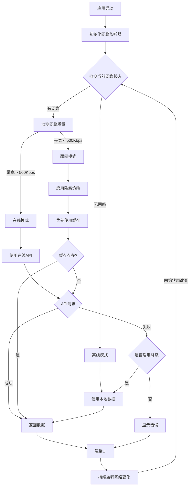

# Android WebView 离线/在线双模式方案设计

[[toc]]

## 一、项目背景

### 1.1 需求概述
开发个人知识库管理 Demo，需要在 Android App 中通过 WebView 展示。由于涉及会场演示，需考虑网络不稳定的情况，设计双模式运行机制：

**在线模式（Online Mode）**
- 前端资源从服务器或本地加载
- 接口正常调用后端服务
- 实时获取最新数据

**离线模式（Offline Mode）**
- 前端静态资源本地化
- 预设默认数据和问答示例
- 从本地缓存或 JSON 文件获取数据
- 在断网/弱网环境下正常运行

### 1.2 文档目标
- 调研可行的技术方案
- 分析各方案的优劣势
- 评估潜在风险
- 设计网络状态切换逻辑
- 提供可落地的实施方案

---

## 二、核心技术挑战

### 2.1 Vite/Nuxt 打包问题

#### 问题描述
当前项目使用 Nuxt 3 + Vite 构建，存在以下技术障碍：

**ES Module 跨域问题**
```html
<!-- Vite 默认输出格式 -->
<script type="module" crossorigin src="./assets/xxx.js"></script>
```

- Vite 默认输出 ES Module 格式
- `type="module"` 需要 HTTP(S) 协议才能正常加载
- 使用 `file://` 协议会触发 CORS 限制
- WebView 中直接加载会导致模块加载失败

#### 已尝试方案
使用 `@vitejs/plugin-legacy` 插件转换为传统模块格式，但仍需进一步处理打包产物。

### 2.2 跨域问题汇总

| 问题类型 | 影响范围 | 解决方案 | 风险等级 |
|---------|---------|---------|---------|
| CGI 请求跨域 | API 调用 | 跨域请求头增加 `null` 支持 | 中 |
| Cookie 跨域 | 用户认证 | 当前无 Cookie 操作，暂无影响 | 低 |
| LocalStorage 跨域 | 本地存储 | 调用原生方法存储（如需要） | 低 |
| 前端资源路径 | 静态资源加载 | 使用相对路径 | 低 |

---

## 三、技术方案对比

### 3.1 方案一：WebViewAssetLoader

#### 方案概述
使用 Google 官方推荐的 `WebViewAssetLoader` 加载离线资源，通过虚拟域名方式避免 `file://` 协议的安全和跨域问题。

#### 技术实现

**添加依赖**
```gradle
implementation 'androidx.webkit:webkit:1.4.0'
```

**核心代码示例**
```kotlin
import android.os.Bundle
import android.webkit.*
import androidx.activity.ComponentActivity
import androidx.webkit.WebViewAssetLoader

class WebViewActivity : ComponentActivity() {
    override fun onCreate(savedInstanceState: Bundle?) {
        super.onCreate(savedInstanceState)
        val webView = WebView(this)
        setContentView(webView)

        // 配置 AssetLoader
        val assetLoader = WebViewAssetLoader.Builder()
            .addPathHandler("/assets/", WebViewAssetLoader.AssetsPathHandler(this))
            .addPathHandler("/res/", WebViewAssetLoader.ResourcesPathHandler(this))
            .build()

        webView.webViewClient = object : WebViewClient() {
            override fun shouldInterceptRequest(
                view: WebView,
                request: WebResourceRequest
            ): WebResourceResponse? {
                return assetLoader.shouldInterceptRequest(request.url)
            }
        }

        val webSettings = webView.settings
        webSettings.apply {
            javaScriptEnabled = true
            domStorageEnabled = true
            databaseEnabled = true
            cacheMode = WebSettings.LOAD_DEFAULT
            allowFileAccess = false  // 提升安全性
            allowContentAccess = false
        }

        // 加载本地资源
        webView.loadUrl("https://appassets.androidplatform.net/assets/index.html")
    }
}
```

#### 优势分析
| 优势项 | 说明 |
|-------|------|
| ✅ 官方推荐 | Google 官方文档推荐方案 |
| ✅ 安全性高 | 避免 `file://` 协议的安全风险 |
| ✅ 无跨域问题 | 通过虚拟域名（`https://appassets.androidplatform.net`）加载资源 |
| ✅ API 支持好 | 内置多种资源加载器（Assets/Resources） |
| ✅ 维护性强 | 长期支持，兼容性好 |

#### 劣势分析
| 劣势项 | 说明 | 缓解方案 |
|-------|------|---------|
| ❌ 需要前端配合 | 需调整资源路径 | 构建时自动处理路径 |
| ❌ 依赖库版本 | 需要 androidx.webkit 1.4.0+ | 团队统一依赖版本 |

#### 适用场景
- ✅ 需要完全离线运行
- ✅ 对安全性有较高要求
- ✅ 需要加载复杂前端应用

---

### 3.2 方案二：WebView 缓存策略

#### 方案概述
利用 WebView 自带的缓存机制，首次在线加载后，后续可在离线环境下访问。

#### 技术实现

```kotlin
class WebViewActivity : ComponentActivity() {
    override fun onCreate(savedInstanceState: Bundle?) {
        super.onCreate(savedInstanceState)
        val webView = WebView(this)
        setContentView(webView)

        val webSettings = webView.settings
        webSettings.apply {
            javaScriptEnabled = true
            domStorageEnabled = true      // 启用 LocalStorage
            databaseEnabled = true         // 启用数据库
            
            // 缓存策略：优先使用缓存，无缓存时再请求网络
            cacheMode = WebSettings.LOAD_CACHE_ELSE_NETWORK
            
            // 应用缓存（已废弃但部分场景仍有效）
            setAppCacheEnabled(true)
            setAppCachePath(cacheDir.absolutePath)
            
            allowFileAccess = true
        }

        webView.webViewClient = WebViewClient()
        webView.loadUrl("https://your-domain.com/")
    }
}
```

#### 缓存策略对比

| 缓存模式 | 说明 | 适用场景 |
|---------|------|---------|
| `LOAD_DEFAULT` | 默认模式，根据 HTTP 缓存头决策 | 正常在线使用 |
| `LOAD_CACHE_ELSE_NETWORK` | 优先缓存，无缓存时请求网络 | 离线优先场景 |
| `LOAD_NO_CACHE` | 不使用缓存，始终请求网络 | 需要实时数据 |
| `LOAD_CACHE_ONLY` | 仅使用缓存，不请求网络 | 完全离线模式 |

#### 测试验证
**测试步骤：**
1. 开启网络 → 打开 App → 访问首页 → 访问详情页 → 关闭 App
2. 关闭网络 → 打开 App → 访问首页 → 访问详情页（已访问过的）
3. 结果：正常访问 ✅

#### 优势分析
| 优势项 | 说明 |
|-------|------|
| ✅ 实现简单 | 配置几行代码即可 |
| ✅ 无需额外依赖 | 使用原生 WebView API |
| ✅ 自动管理 | 系统自动管理缓存生命周期 |

#### 劣势分析
| 劣势项 | 说明 | 缓解方案 |
|-------|------|---------|
| ❌ 首次需联网 | 必须先在线访问一次 | 预加载关键页面 |
| ❌ 缓存不可控 | 系统可能清理缓存 | 结合 Service Worker |
| ❌ 动态内容受限 | API 请求无法离线 | 需配合离线数据方案 |

#### 适用场景
- ✅ 内容更新频率低
- ✅ 偶尔离线访问
- ✅ 快速实现原型

---

### 3.3 方案三：Android 端启动本地 HTTP 服务

#### 方案概述
在 Android 端启动一个本地 HTTP Server，WebView 访问 `http://localhost:port` 来加载静态资源。

#### 技术实现

**使用 NanoHTTPD 库**
```kotlin
import fi.iki.elonen.NanoHTTPD
import java.io.File

class LocalWebServer(port: Int, private val wwwRoot: File) : NanoHTTPD(port) {
    override fun serve(session: IHTTPSession): Response {
        var uri = session.uri
        if (uri == "/") uri = "/index.html"
        
        val file = File(wwwRoot, uri)
        if (!file.exists() || !file.isFile) {
            return newFixedLengthResponse(Response.Status.NOT_FOUND, "text/plain", "Not Found")
        }
        
        val mimeType = getMimeType(uri)
        return newChunkedResponse(Response.Status.OK, mimeType, file.inputStream())
    }
    
    private fun getMimeType(uri: String): String {
        return when {
            uri.endsWith(".html") -> "text/html"
            uri.endsWith(".js") -> "application/javascript"
            uri.endsWith(".css") -> "text/css"
            uri.endsWith(".json") -> "application/json"
            else -> "application/octet-stream"
        }
    }
}

// 使用
class WebViewActivity : ComponentActivity() {
    private lateinit var server: LocalWebServer
    
    override fun onCreate(savedInstanceState: Bundle?) {
        super.onCreate(savedInstanceState)
        
        // 复制 assets 到缓存目录
        val wwwDir = File(cacheDir, "www")
        copyAssetsToCache(wwwDir)
        
        // 启动服务器
        server = LocalWebServer(8080, wwwDir)
        server.start()
        
        val webView = WebView(this)
        setContentView(webView)
        webView.loadUrl("http://localhost:8080/")
    }
    
    override fun onDestroy() {
        super.onDestroy()
        server.stop()
    }
}
```

#### 优势分析
| 优势项 | 说明 |
|-------|------|
| ✅ 完美兼容 | 符合前端开发环境，无需修改代码 |
| ✅ 无跨域问题 | HTTP 协议，ES Module 正常工作 |
| ✅ 调试友好 | 可使用 Chrome DevTools |

#### 劣势分析
| 劣势项 | 说明 | 风险等级 |
|-------|------|---------|
| ❌ 性能开销 | 需要启动 HTTP 服务 | 中 |
| ❌ 端口占用 | 可能与其他应用冲突 | 中 |
| ❌ 电量消耗 | 持续运行服务 | 低 |
| ❌ 测试失败 | 实测出现白屏 | 高 |

#### 适用场景
- ⚠️ 需要完全兼容 Vite/Webpack 构建产物
- ⚠️ 前端无法修改打包配置
- ❌ 测试结果不理想，不推荐使用

---

### 3.4 方案四：重构为 React + Webpack

#### 方案概述
放弃 Nuxt 3 + Vite，改用 React + Webpack 构建，输出传统非模块化脚本。

#### 优势分析
| 优势项 | 说明 |
|-------|------|
| ✅ 打包兼容性好 | Webpack 对传统模块支持完善 |
| ✅ 社区方案成熟 | 大量离线包实践案例 |

#### 劣势分析
| 劣势项 | 说明 | 风险等级 |
|-------|------|---------|
| ❌ 技术栈断层 | 与现有项目技术栈不一致 | 高 |
| ❌ 重构成本高 | 需要重新搭建整个项目 | 高 |
| ❌ 代码复用性差 | 无法复用现有 Nuxt 代码 | 高 |
| ❌ 维护成本增加 | 需维护两套技术栈 | 高 |

#### 适用场景
- ❌ 不推荐，成本收益比不合理

---

## 四、网络状态切换方案设计

### 4.1 网络状态检测

#### 实现方案

**Android 端网络监听**
```kotlin
import android.content.Context
import android.net.*
import kotlinx.coroutines.flow.MutableStateFlow
import kotlinx.coroutines.flow.StateFlow

enum class NetworkStatus {
    ONLINE,      // 在线
    OFFLINE,     // 离线
    WEAK         // 弱网
}

class NetworkMonitor(context: Context) {
    private val connectivityManager = context.getSystemService(Context.CONNECTIVITY_SERVICE) as ConnectivityManager
    private val _networkStatus = MutableStateFlow(NetworkStatus.OFFLINE)
    val networkStatus: StateFlow<NetworkStatus> = _networkStatus
    
    private val networkCallback = object : ConnectivityManager.NetworkCallback() {
        override fun onAvailable(network: Network) {
            checkNetworkQuality(network)
        }
        
        override fun onLost(network: Network) {
            _networkStatus.value = NetworkStatus.OFFLINE
        }
        
        override fun onCapabilitiesChanged(network: Network, capabilities: NetworkCapabilities) {
            checkNetworkQuality(network, capabilities)
        }
    }
    
    private fun checkNetworkQuality(network: Network, capabilities: NetworkCapabilities? = null) {
        val caps = capabilities ?: connectivityManager.getNetworkCapabilities(network)
        
        when {
            caps == null -> {
                _networkStatus.value = NetworkStatus.OFFLINE
            }
            caps.linkDownstreamBandwidthKbps < 500 -> {
                _networkStatus.value = NetworkStatus.WEAK
            }
            else -> {
                _networkStatus.value = NetworkStatus.ONLINE
            }
        }
    }
    
    fun startMonitoring() {
        val request = NetworkRequest.Builder()
            .addCapability(NetworkCapabilities.NET_CAPABILITY_INTERNET)
            .build()
        connectivityManager.registerNetworkCallback(request, networkCallback)
    }
    
    fun stopMonitoring() {
        connectivityManager.unregisterNetworkCallback(networkCallback)
    }
}
```

**前端网络状态同步**
```kotlin
// 在 WebView 中注入 JavaScript 接口
webView.addJavascriptInterface(object {
    @JavascriptInterface
    fun getNetworkStatus(): String {
        return when (networkMonitor.networkStatus.value) {
            NetworkStatus.ONLINE -> "online"
            NetworkStatus.OFFLINE -> "offline"
            NetworkStatus.WEAK -> "weak"
        }
    }
}, "AndroidBridge")

// 监听网络状态变化并通知前端
lifecycleScope.launch {
    networkMonitor.networkStatus.collect { status ->
        webView.evaluateJavascript(
            "window.dispatchEvent(new CustomEvent('networkchange', { detail: '${status.name.lowercase()}' }))",
            null
        )
    }
}
```

**前端监听网络变化**
```typescript
// composables/useNetworkStatus.ts
import { ref, onMounted, onUnmounted } from 'vue'

export function useNetworkStatus() {
  const networkStatus = ref<'online' | 'offline' | 'weak'>('online')
  
  const handleNetworkChange = (event: CustomEvent) => {
    networkStatus.value = event.detail
    console.log('网络状态变化:', event.detail)
    
    // 根据网络状态切换数据源
    if (event.detail === 'offline' || event.detail === 'weak') {
      // 切换到本地数据源
      useOfflineData()
    } else {
      // 切换到在线数据源
      useOnlineData()
    }
  }
  
  onMounted(() => {
    window.addEventListener('networkchange', handleNetworkChange)
    
    // 初始化时检测网络状态
    if (window.AndroidBridge) {
      networkStatus.value = window.AndroidBridge.getNetworkStatus()
    }
  })
  
  onUnmounted(() => {
    window.removeEventListener('networkchange', handleNetworkChange)
  })
  
  return { networkStatus }
}
```

### 4.2 数据源切换策略

#### 前端数据层设计

```typescript
// composables/useDataSource.ts
import { ref } from 'vue'

interface DataSourceConfig {
  mode: 'online' | 'offline'
  enableFallback: boolean  // 是否启用降级
}

export function useDataSource() {
  const config = ref<DataSourceConfig>({
    mode: 'online',
    enableFallback: true
  })
  
  // 在线数据获取
  async function fetchOnlineData(endpoint: string) {
    try {
      const response = await fetch(endpoint, { timeout: 5000 })
      if (!response.ok) throw new Error('Network response was not ok')
      return await response.json()
    } catch (error) {
      console.error('在线数据获取失败:', error)
      
      // 降级到离线数据
      if (config.value.enableFallback) {
        return fetchOfflineData(endpoint)
      }
      throw error
    }
  }
  
  // 离线数据获取
  async function fetchOfflineData(endpoint: string) {
    // 从本地 JSON 文件获取
    const mockDataMap: Record<string, string> = {
      '/api/questions': '/mock-data/questions.json',
      '/api/documents': '/mock-data/documents.json',
    }
    
    const mockPath = mockDataMap[endpoint]
    if (!mockPath) {
      throw new Error(`No offline data for ${endpoint}`)
    }
    
    try {
      const response = await fetch(mockPath)
      return await response.json()
    } catch (error) {
      console.error('离线数据获取失败:', error)
      throw error
    }
  }
  
  // 统一数据获取接口
  async function fetchData(endpoint: string) {
    if (config.value.mode === 'offline') {
      return fetchOfflineData(endpoint)
    }
    return fetchOnlineData(endpoint)
  }
  
  return {
    config,
    fetchData,
    fetchOnlineData,
    fetchOfflineData
  }
}
```

### 4.3 网络切换流程图



### 4.4 网络波动处理策略

| 场景 | 策略 | 说明 |
|-----|------|------|
| 在线 → 离线 | 立即切换到本地数据 | 避免用户感知中断 |
| 离线 → 在线 | 延迟切换，继续使用缓存 | 避免频繁切换 |
| 在线 → 弱网 | 启用降级策略 | 优先使用缓存，减少请求 |
| 弱网 → 在线 | 逐步恢复正常请求 | 平滑过渡 |
| 弱网 → 离线 | 立即切换到本地数据 | 避免长时间等待 |

#### 防抖策略

```typescript
// composables/useNetworkDebounce.ts
import { ref } from 'vue'

export function useNetworkDebounce(delayMs: number = 3000) {
  let timer: NodeJS.Timeout | null = null
  const pendingStatus = ref<string | null>(null)
  
  function debounceNetworkChange(newStatus: string, callback: (status: string) => void) {
    pendingStatus.value = newStatus
    
    if (timer) clearTimeout(timer)
    
    // 从离线恢复到在线时，延迟切换
    if (newStatus === 'online') {
      timer = setTimeout(() => {
        callback(newStatus)
        pendingStatus.value = null
      }, delayMs)
    } else {
      // 立即切换到离线/弱网
      callback(newStatus)
      pendingStatus.value = null
    }
  }
  
  return { debounceNetworkChange, pendingStatus }
}
```

---

## 五、推荐方案与实施路径

### 5.1 综合评估

| 方案 | 技术难度 | 实现成本 | 可维护性 | 安全性 | 推荐指数 |
|-----|---------|---------|---------|-------|---------|
| WebViewAssetLoader | ⭐⭐⭐ | ⭐⭐⭐ | ⭐⭐⭐⭐⭐ | ⭐⭐⭐⭐⭐ | ⭐⭐⭐⭐⭐ |
| WebView 缓存 | ⭐⭐ | ⭐ | ⭐⭐⭐ | ⭐⭐⭐ | ⭐⭐⭐⭐ |
| 本地 HTTP 服务 | ⭐⭐⭐⭐ | ⭐⭐⭐⭐ | ⭐⭐ | ⭐⭐ | ⭐⭐ |
| React + Webpack | ⭐⭐⭐⭐⭐ | ⭐⭐⭐⭐⭐ | ⭐ | ⭐⭐⭐ | ⭐ |

### 5.2 推荐方案：混合策略

**方案组合：WebViewAssetLoader + WebView 缓存 + 网络状态监听**

#### 实施步骤

**阶段一：前端改造（Week 1）**
1. ✅ 配置 Vite 构建，调整资源路径为相对路径
2. ✅ 实现网络状态监听 Composable
3. ✅ 创建数据源切换层
4. ✅ 准备离线 Mock 数据（JSON 文件）

**阶段二：Android 端实现（Week 2）**
1. ✅ 集成 WebViewAssetLoader
2. ✅ 实现网络状态监听
3. ✅ 配置 WebView 缓存策略
4. ✅ 实现 JavaScript Bridge 通信

**阶段三：联调测试（Week 3）**
1. ✅ 在线模式功能测试
2. ✅ 离线模式功能测试
3. ✅ 网络切换场景测试
4. ✅ 性能测试与优化

#### 前端构建配置示例

```typescript
// nuxt.config.ts
export default defineNuxtConfig({
  ssr: false,  // 纯客户端渲染
  
  app: {
    baseURL: './',  // 使用相对路径
    buildAssetsDir: 'assets/',
  },
  
  vite: {
    build: {
      assetsInlineLimit: 0,  // 不内联资源
      cssCodeSplit: false,   // CSS 不分割
    }
  },
  
  nitro: {
    preset: 'static'
  }
})
```

**构建后处理脚本**
```javascript
// scripts/post-build.js
import { readFileSync, writeFileSync } from 'fs'
import { glob } from 'glob'

// 处理 HTML 中的资源路径
const htmlFiles = glob.sync('dist/**/*.html')
htmlFiles.forEach(file => {
  let content = readFileSync(file, 'utf-8')
  
  // 移除 crossorigin 属性
  content = content.replace(/\s*crossorigin="[^"]*"/g, '')
  
  // 确保路径为相对路径
  content = content.replace(/href="\/assets\//g, 'href="./assets/')
  content = content.replace(/src="\/assets\//g, 'src="./assets/')
  
  writeFileSync(file, content)
})

console.log('✅ 离线包处理完成')
```

---

## 六、风险评估与应对

### 6.1 技术风险

| 风险项 | 风险等级 | 影响 | 应对措施 |
|-------|---------|------|---------|
| Vite 模块化兼容性 | 高 | 离线包无法加载 | 使用 WebViewAssetLoader + 构建后处理 |
| 网络切换不及时 | 中 | 用户体验受影响 | 实现防抖机制，避免频繁切换 |
| 离线数据过期 | 中 | 展示旧数据 | 在线时自动更新本地数据 |
| 缓存清理 | 低 | 离线模式失效 | 重要数据存放在 assets 中 |

### 6.2 业务风险

| 风险项 | 风险等级 | 影响 | 应对措施 |
|-------|---------|------|---------|
| 演示场景网络波动 | 高 | 功能演示失败 | 提前切换到离线模式 |
| 离线数据不完整 | 中 | 部分功能不可用 | 提供离线功能清单 |
| 用户误操作 | 低 | 数据不一致 | 增加模式指示器 |

### 6.3 应急预案

**演示前准备 Checklist**
- [ ] 提前加载所有页面，确保缓存完整
- [ ] 验证离线数据文件完整性
- [ ] 测试离线模式所有关键功能
- [ ] 准备手动切换离线模式的开关
- [ ] 备份演示数据到 assets 目录

**现场应急措施**
```kotlin
// 添加强制离线模式开关
class WebViewActivity : ComponentActivity() {
    private var forceOfflineMode = false
    
    // 三击标题栏切换强制离线模式
    private var clickCount = 0
    private var lastClickTime = 0L
    
    private fun setupEmergencySwitch() {
        titleBar.setOnClickListener {
            val currentTime = System.currentTimeMillis()
            if (currentTime - lastClickTime < 500) {
                clickCount++
                if (clickCount >= 3) {
                    forceOfflineMode = !forceOfflineMode
                    Toast.makeText(this, "强制离线模式: $forceOfflineMode", Toast.LENGTH_SHORT).show()
                    webView.reload()
                    clickCount = 0
                }
            } else {
                clickCount = 1
            }
            lastClickTime = currentTime
        }
    }
}
```

---

## 七、参考资料

### 官方文档
- [Android WebView 官方文档](https://developer.android.com/reference/android/webkit/WebView)
- [WebViewAssetLoader 官方指南](https://developer.android.com/reference/androidx/webkit/WebViewAssetLoader)
- [Vite 构建生产版本](https://vitejs.dev/guide/build.html)
- [Nuxt 静态部署](https://nuxt.com/docs/getting-started/deployment#static-hosting)

### 社区方案
- [WebView 离线包加载最佳实践](https://article.juejin.cn/post/7051928499849789476)
- [Android WebView 缓存机制详解](https://developer.aliyun.com/article/1607152)
- [WebView 跨域问题解决方案](https://juejin.cn/post/7436272415435915316)
- [WebViewAssetLoader 实战指南](https://juejin.cn/post/7168382788905730062)
- [Hybrid App 离线化方案](https://juejin.cn/post/7119662876578545678)

---

## 八、总结

### 核心要点
1. **推荐使用 WebViewAssetLoader** 作为离线资源加载方案，安全性和兼容性最佳
2. **结合 WebView 缓存策略** 实现在线/离线自动切换
3. **实现健壮的网络监听机制** 处理各种网络状态变化
4. **准备完善的应急预案** 确保演示万无一失

### 下一步行动
- [ ] 前端团队：改造构建配置，适配离线包
- [ ] Android 团队：实现 WebViewAssetLoader 和网络监听
- [ ] 测试团队：制定详细测试用例
- [ ] 产品团队：准备演示 Demo 数据

---

**文档版本：** v1.0  
