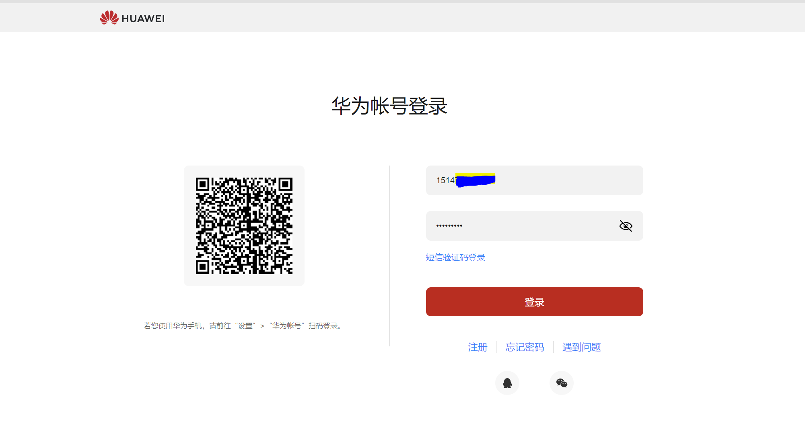
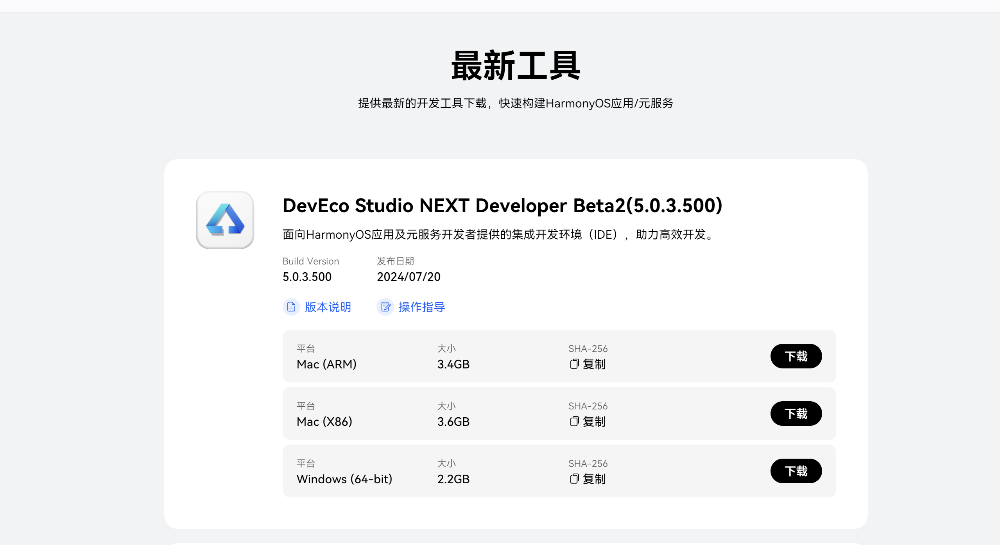
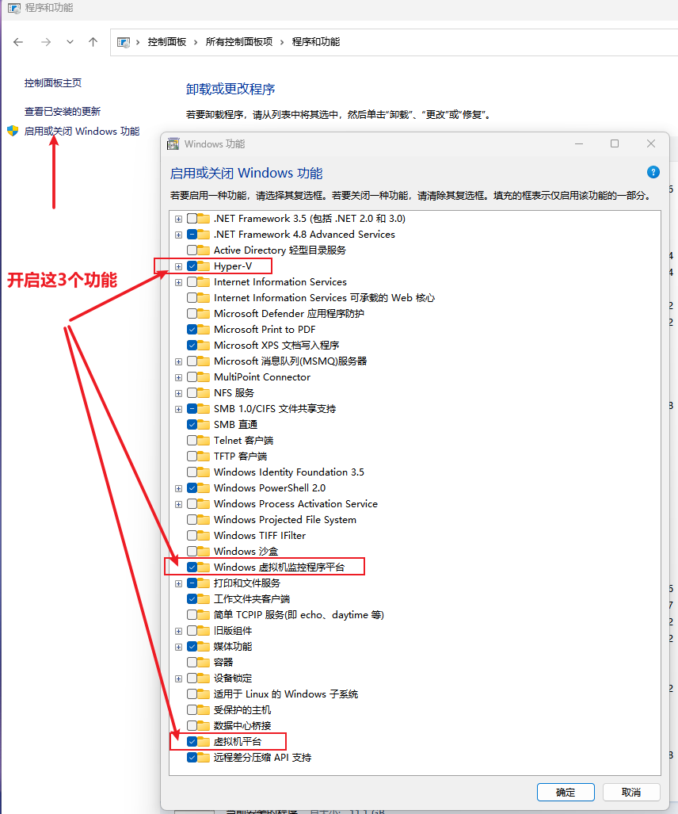
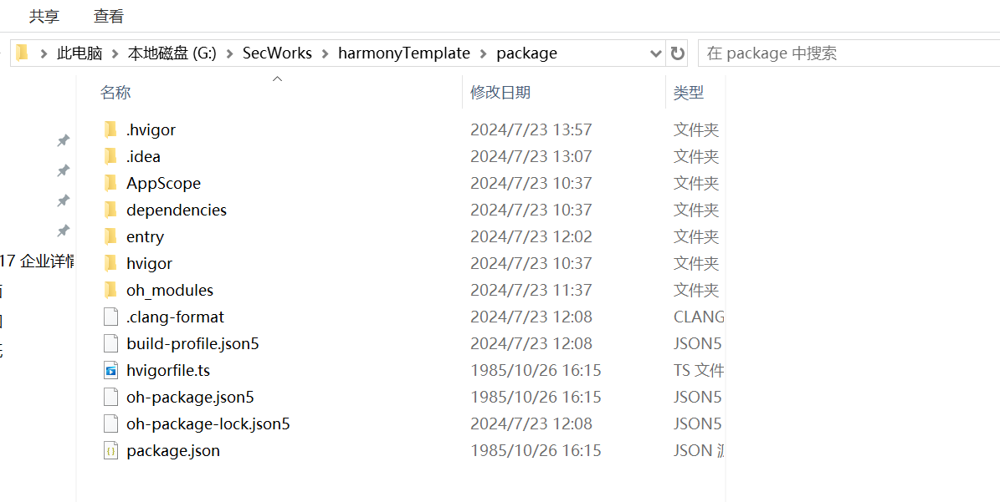
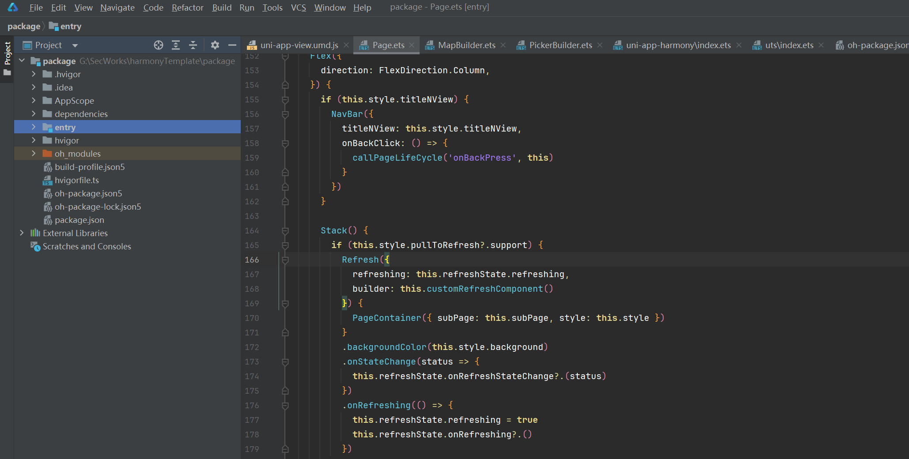

# uniapp 升级打包鸿蒙方案整理和测试
[[toc]]


## 背景
uni-app 团队已立项启动鸿蒙next的兼容支持工作，预计2024年7月初发布Alpha版本。由于vue2和weex已经不再维护，uni-app的鸿蒙next版本也不会包含相关技术：
- 建议vue2的开发者尽快将升级到 vue 3 版本。
- nvue的开发者尽快升级到uni-app x 版本

## vue2升级vue3参考文档整理
- 升级指南：[https://ask.dcloud.net.cn/article/id-37834__page-2](https://ask.dcloud.net.cn/article/id-37834__page-2)
- uniapp：vue2-vue3：[https://uniapp.dcloud.net.cn/tutorial/migration-to-vue3.html](https://uniapp.dcloud.net.cn/tutorial/migration-to-vue3.html)
- vue2-vue3: [https://v3-migration.vuejs.org/zh/migration-build.html](https://v3-migration.vuejs.org/zh/migration-build.html)
- [https://juejin.cn/post/7068556246781001765](https://juejin.cn/post/7068556246781001765)
- [https://www.cnblogs.com/miangao/p/17424087.html](https://www.cnblogs.com/miangao/p/17424087.html)
- [https://github.com/originjs/vue2-element-touzi-admin/commit/21aeb41bf8595a7a6323a92ed9326cec4c7f5955](https://github.com/originjs/vue2-element-touzi-admin/commit/21aeb41bf8595a7a6323a92ed9326cec4c7f5955)
- [https://juejin.cn/post/7316343619107913763](https://juejin.cn/post/7316343619107913763)

## 调研迁移到 Vue3 中原有的 Demo 中哪些三方库或者方法将不可用

## 最终方法：渐进式迁移到HBuilder版vue3项目中
- 辅助工具：
  Gogocode 升级vue3工具（将vue2转vue3语法)<br>
  vue-codemod自动转换工具
- 确认升级流程以及方式（本次升级采用渐进式语法修改形式），主要方式为迁移一个组件则将修改一个组件的语法为 vue3，如该组件依赖多个组件则先切断相组件的连接（注释大法），后续逐步放开并配套修改。

## 升级步骤
1. 创建一个HBuilder vue3新版本
   （因为打包鸿蒙目前只能通过HBuilder版）
2. 根据原项目改造底层框架
3. 接入原项目公共模块
4. 接入首页入口页面
5. 按照功能划分逐一迁移后续页面

测试项目地址：G:\SecWorks\shuidi-mini-vue3\shuidi-mini-vue3

## uniapp鸿蒙空项目配置打包流程
官网文档地址: [https://zh.uniapp.dcloud.io/tutorial/harmony/dev.html](https://zh.uniapp.dcloud.io/tutorial/harmony/dev.html)

### 实践流程
#### 工具下载
- 下载鸿蒙开发者工具：DevEco-Studio 5.0.3.400 以上
- 注：不要到uniapp提供的入口下载，会要求申请开发者套件才可以下载，正确下载地址是鸿蒙开发者平台，需要登录华为账号（并且提前做好身份认真，后续使用开发者工具需要）
- 鸿蒙开发者平台开发工具下载地址：[https://developer.huawei.com/consumer/cn/deveco-studio/](https://developer.huawei.com/consumer/cn/deveco-studio/)

##### 登录华为账号



##### 下载并安装最新版本


##### 下载：HBuilderX-4.22 以上：
- 注：官方提示需要下载的版本是：HBuilderX-alpha-4.22 以上  alpha 版本，但是实测alpha会报错“不支持vue2项目” （当前项目已经是vue3)，经过测试使用正式版 HBuilderX-4.23 可以正常打包鸿蒙
- Windows系统如使用模拟器则需要开启以下功能：按照官网文档配置即可


#### 配置鸿蒙离线SDK（鸿蒙项目模板）
- 下载 uni-app 鸿蒙离线SDK template-1.3.4.tgz [下载地址](https://web-ext-storage.dcloud.net.cn/uni-app/harmony/zip/template-1.3.4.tgz)
##### 1.下载解压后的地址示例：G:\SecWorks\harmonyTemplate\package

##### 2.解压刚下载的压缩包，将解压后的模板工程在 DevEco-Studio 中打开

##### 3.等待 Sync 结束，点击运行按钮可以将工程运行在真机或者模拟器中（如未配置签名信息可能需要先行配置）

#### 启动鸿蒙模拟器
- 按照官方文档启动鸿蒙模拟器：需要登录华为账号，并且认证个人身份

#### 连接鸿蒙真机
打开鸿蒙手机开发者模式，开启USB调试，通过USB线连接电脑，在此处选择你的手机名称，再启动项目即可，如果提示需要先签名，则进行 [配置签名](https://zh.uniapp.dcloud.io/tutorial/harmony/dev.html#signature)

#### 配置签名
- 按照官方文档说明配置签名

#### 配置 HBuilderX settings.json
- 打开HBuilderX，点击上方菜单 - 工具 - 设置，在出现的弹窗右侧用户设置窗体新增如下配置
- **注意：值填你自己的 DevEco-Studio 启动路径，文档和社区给了两种配置方式**
- 第一种
```
"harmony.devTools.path" : "C:/Program Files/Huawei/DevEco Studio
```
- 第二种
```
"harmony.devTools.path" : "C:/Program Files/Huawei/DevEco Studio/bin/devecostudio64.exe"
```
- **注：如果两种配置都不能自动调起鸿蒙开发者工具，则需要手动打开开发者工具，并且启动鸿蒙模板项目**

#### 配置 uni-app 工程
##### HBuilderX 新建一个空白的 uniapp 项目，选vue3
- **注：目前官方值给了HBuilderX版项目案例，没有给出cli版案例文档，我实测了下cli版vue3+vite的项目，打包鸿蒙虽然编译成功了但是模板项目并没有更新，目前应该还没有支持，所有现在只能使用vue3版本的HBuilderx版项目**
- 在 新项目manifest.json 文件中配置鸿蒙离线SDK路径
```
"app-harmony" : {
        "projectPath" : "G:\\SecWorks\\harmonyTemplate\\package"
},
```
##### 编译 uni-app 到鸿蒙
- 点击 HBuilderX 上方【运行】菜单，运行到鸿蒙 DevEco Studio
- 注：如果没有出现此菜单，请确认你的 HBuilderX 版本是否是 4.22 及以上，或者重新启动
- **注：实测 可能会报 “目前尚不支持 vue 2 项目运行到鸿蒙”，解决方法：保证使用正式版 HBuilderX4.22 及以上版本，并且先将项目运行到浏览器或者小程序，再点击编译到鸿蒙及可解决这个报错。**

##### 在 DevEco-Studio 重新编译或运行
- 先等待 HBuilderX 编译完成，然后打开 DevEco-Studio，点击运行按钮，运行到模拟器或者真机
- **注：preview预览失败，目前只能使用模拟器或真机预览**
