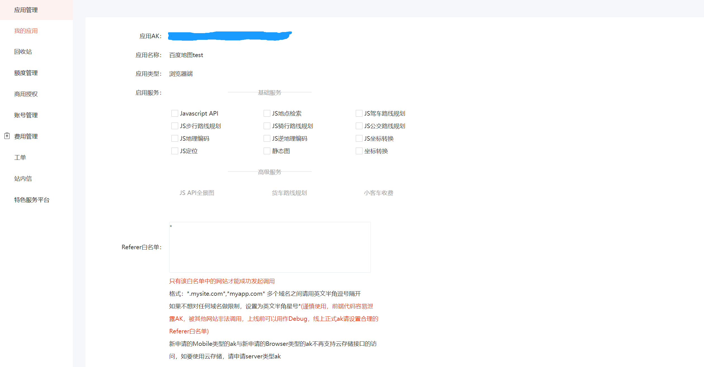

# 百度地图api react应用案例

[[toc]]

## 申请百度地图api ak

### 登录并实名制百度地图api平台

[https://lbsyun.baidu.com/](https://lbsyun.baidu.com/)

### 申请JavaScript应用，获取ak


## 动态导入

### 引入百度地图api

注意： 需要使用 window.init = bmapInit; 修改init函数指向，否则回调函数不生效。

```js
let companyLocation = {lng: 116.404, lat: 39.915} // 企业坐标

useEffect(() => {
    init()
    initMap()
}, [])

// 初始化请求数据
const init = () => {
    const result = await getData()
    const {location} = result ?? {}
    companyLocation = location
    initMap()
}


/**
 * 地图初始化注入
 */
const initMap = () => {
    // 指向init回调函数
    window.init = bmapInit;
    const script = document.createElement('script');
    script.type = 'text/javascript';
    script.src = 'https://api.map.baidu.com/api?v=1.0&type=webgl&ak=.........&callback=init'
    document.body.appendChild(script);
}

/**
 * 百度初始化回调，创建地图
 * @param lng
 * @param lat
 */
const bmapInit = (
    lng = companyLocation.lng,
    lat = companyLocation.lat
) => {
    const BMapGL = window.BMapGL;
    if (!BMapGL?.Map) {
        return
    }
    const map = new BMapGL.Map('container'); // 创建Map实例
    const point = new BMapGL.Point(lng, lat); // 创建点坐标
    map.centerAndZoom(point, 16);
    map.enableScrollWheelZoom(); // 启用滚轮放大缩小
    const marker = new BMapGL.Marker(point);        // 创建标注
    map.addOverlay(marker);
}
```

### 创建地图

```html 
<div className="right-page">
    <div id="container"> </div>
</div>
```

```scss
#container {
  width: 100%;
  height: 100%;
  border: solid 1px #ececec;

  .BMap_cpyCtrl {
    display: none !important;
  }
}
```

## 全局导入 
### 在public/index.html中引入sdk

```html

<head>
    <script type="text/javascript" src="https://api.map.baidu.com/api?v=1.0&type=webgl&ak=.............."></script>
</head>
```

### 创建地图

```js
function init() {
    console.log(2222)
    const BMapGL = window.BMapGL;
    var map = new BMapGL.Map('container'); // 创建Map实例
    var point = new BMapGL.Point(116.404, 39.915); // 创建点坐标
    map.centerAndZoom(point, 10);
    map.enableScrollWheelZoom(); // 启用滚轮放大缩小
    var marker = new BMapGL.Marker(point);        // 创建标注
    map.addOverlay(marker);                     // 将标注添加到地图中
}
```
