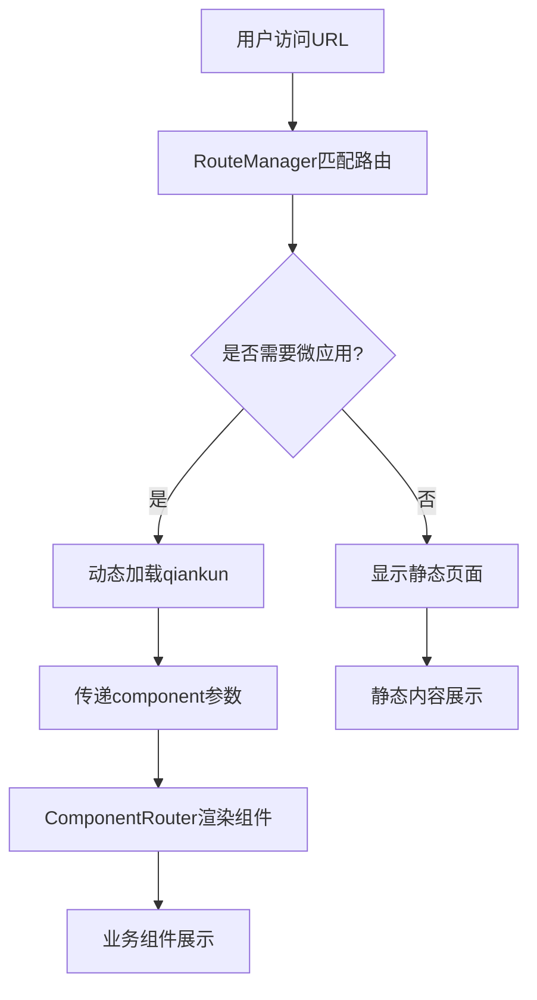

# 基于 qiankun 的JQ老项目升级-基础方案

## 📋 项目概述

为实现团队JQ老项目升级和扩展，基于 **qiankun 微前端框架** ，采用"主应用 + 子应用"的架构模式，目标实现组件级别的微前端管理。

### 技术栈配置

| 应用类型 | 技术栈 | 端口 | 职责 |
|---------|--------|------|------|
| **主应用** | jQuery 3.6.0 + qiankun 2.10.16 + Webpack 5 | 8080 | 路由控制、应用加载管理、全局导航 |
| **子应用** | React 18.2.0 + Ant Design 5.2.0 + Webpack 5 | 3000 | 业务组件渲染、具体功能实现 |

---

## 🔧 核心技术实现

### 1. 动态微应用加载机制

项目采用动态注入 qiankun 的方式，实现按需加载：

#### 主应用路由配置
```javascript
// 主应用中的路由配置
getRouteConfig() {
    return {
        '/data-market': { needMicroApp: true, component: 'data-market' },
        '/analytics': { needMicroApp: true, component: 'analytics' },
        '/reports': { needMicroApp: true, component: 'reports' },
        '/chart-modal': { needMicroApp: true, component: 'chart-modal' }
    };
}
```

#### 动态加载逻辑
```javascript
// 动态加载微应用
loadMicroApp(component) {
    this.currentApp = loadMicroApp({
        name: `react-app-${component}`,
        entry: '//localhost:3000',
        container: '#subapp-container',
        props: { component: component } // 关键：传递组件名
    });
}
```

### 2. URL 路由与组件映射

实现了基于 URL 的组件动态加载机制：

- `http://localhost:8080/data-market` → 数据集市页面组件
- `http://localhost:8080/analytics` → 分析弹窗组件  
- `http://localhost:8080/reports` → 报表中心组件
- `http://localhost:8080/chart-modal` → 图表弹窗组件

### 3. 子应用组件路由器

子应用内部通过 `ComponentRouter` 根据传入参数动态渲染：

```javascript
const ComponentRouter = ({ component, ...props }) => {
  const renderComponent = () => {
    switch (component) {
      case 'data-market': 
        return <DataMarketApp {...props} />;
      case 'analytics': 
        return <AnalyticsApp {...props} />;
      case 'reports': 
        return <ReportsApp {...props} />;
      case 'chart-modal': 
        return <ChartModalApp {...props} />;
      default: 
        return <NotFoundApp {...props} />;
    }
  };
  
  return (
    <ConfigProvider locale={zhCN}>
      {renderComponent()}
    </ConfigProvider>
  );
};
```

### 4. 路由驱动的应用管理

```javascript
// 路由变化时的处理逻辑
async handleRouteChange() {
    const routeInfo = this.routeConfig[currentPath];
    
    if (routeInfo.needMicroApp) {
        // 加载子应用组件
        await this.loadMicroApp(routeInfo.component); 
    } else {
        // 卸载子应用
        await this.unloadMicroApp(); 
        // 显示静态页面
        this.showStaticPage(routeInfo.component); 
    }
}
```

---

## 🎯 架构创新点

### ✨ 单子应用多组件模式
- 只部署一个 React 子应用，通过参数控制渲染不同业务组件
- 避免了多个子应用的部署和维护成本
- 实现了组件级别的微前端粒度

### ⚡ 按需动态加载
- 使用 `loadMicroApp` 而不是 `registerMicroApps`
- 只在需要时才加载和启动 qiankun
- 支持应用的动态卸载和重新加载

### 🚀 路由驱动管理
- 基于路由配置的应用生命周期管理
- 支持静态页面和微应用的混合使用
- 无缝的用户体验切换

---

## 🔄 系统工作流程




### 详细步骤

1. **初始化阶段**：主应用启动，绑定路由监听事件
2. **路由匹配**：用户访问 URL，`RouteManager` 匹配路由配置
3. **动态判断**：根据 `needMicroApp` 决定是否需要加载子应用
4. **组件传递**：将 `component` 参数传递给子应用
5. **组件渲染**：子应用的 `ComponentRouter` 根据参数渲染对应组件
6. **生命周期管理**：支持应用的挂载、卸载和重新加载

---

## 📊 架构优势总结

| 优势类型 | 具体表现 |
|----------|----------|
| **资源节约** | 单个子应用承载多个业务组件，减少资源消耗 |
| **灵活配置** | 通过路由配置表轻松添加新的组件映射 |
| **独立开发** | 主应用和子应用可以独立开发和部署 |
| **技术多样性** | 支持主应用 jQuery + 子应用 React 的技术栈组合 |
| **用户体验** | SPA 级别的切换体验，无页面刷新 |

---

## 🔧 渐进式升级评估

### ✅ 完全支持的场景

| 场景 | 支持度 | 说明 |
|------|--------|------|
| **新功能页面** | 100% | 全部使用 React 开发 |
| **页面级替换** | 100% | 逐步将老页面替换为 React 页面 |
| **API状态共享** | 100% | 老项目接口、状态完全可在子应用中使用 |
| **SDK方法调用** | 100% | 老项目工具类和SDK可在子应用中调用 |

### ⚠️ 需要扩展的场景

| 场景 | 当前状态 | 扩展方案 |
|------|----------|----------|
| **组件级嵌入** | 需要扩展 | 扩展 RouteManager 支持任意容器加载 |
| **弹窗组件** | 需要扩展 | 建立弹窗组件的加载和卸载机制 |
| **事件通信** | 需要完善 | 完善主子应用的事件通信机制 |

---

## 💡 技术总结

> **项目核心特点**：jQuery 主应用 + 单个 React 子应用的微前端架构，通过 URL 路由驱动的方式，动态注入 qiankun 加载子应用，并根据路由参数在子应用内部切换不同的业务组件，实现细粒度的微前端管理。

当前设计可保持微前端的解耦优势，也可避免多应用部署的复杂性，适合小团队项目低成本渐进式升级。